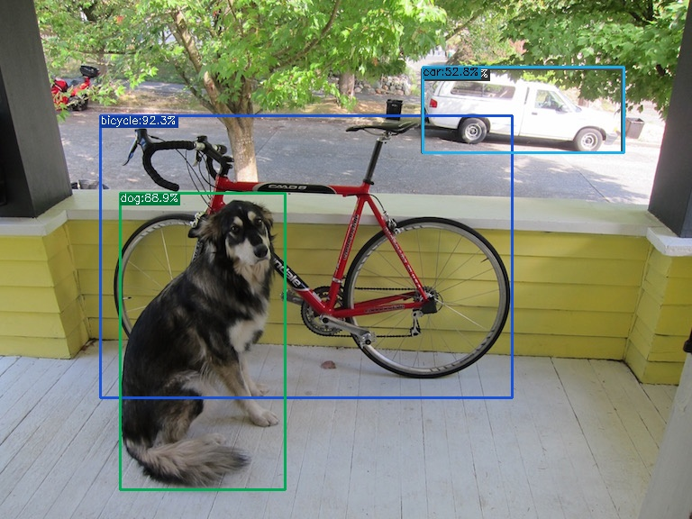

本项目为[yolox](https://github.com/Megvii-BaseDetection/YOLOX)提供docker镜像

这里假设你的电脑有nvidia显卡，并正确安装了docker和nvidia-docker

# 编译镜像

运行以下命令下载dockerfile并编译镜像

```bash
git clone https://github.com/lyyiangang/yolox-dockerfile.git
cd yolox-dockerfile
docker build -f ./Dockerfile.txt -t yolox .
```

# 下载yolox 源码

```bash
git clone https://github.com/Megvii-BaseDetection/YOLOX
mv run-docker.sh YOLOX/
cd YOLOX/
```
只要保证```run-docker.sh```在YOLOX的根目录下就行。

# 启动虚拟容器

按照yolox readme指示下载好对应模型， 比如yolox_s.pth模型文件，运行以下命令测试demo程序

```bash
./run-docker.sh
python tools/demo.py image -n yolox-s -c model/yolox_s.pth --path assets/dog.jpg --conf 0.3 --nms 0.65 --tsize 640 --save_result --device gpu
```
可以得到如下检测结果：



# 测试TensorRT

参考官方的[readme](https://github.com/Megvii-BaseDetection/YOLOX/tree/main/demo/TensorRT/python), 先用```tools/trt.py```生成tensorrt引擎，
然后用```demo.py```推理。
对于分辨率416x416的图片，使用yolox-nano推理，1060 6Gb内存显卡上，推理时间如下：
```
2021-07-26 03:24:55.346 | INFO     | __main__:inference:136 - Infer time: 0.0039s
2021-07-26 03:24:55.365 | INFO     | __main__:inference:136 - Infer time: 0.0041s
2021-07-26 03:24:55.384 | INFO     | __main__:inference:136 - Infer time: 0.0044s
2021-07-26 03:24:55.404 | INFO     | __main__:inference:136 - Infer time: 0.0043s
2021-07-26 03:24:55.426 | INFO     | __main__:inference:136 - Infer time: 0.0075s
```

# TODO

- [x] tensorrt支持
- [x] 支持apex
- [ ] ncnn支持